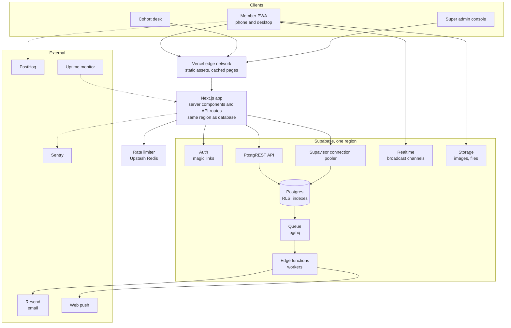
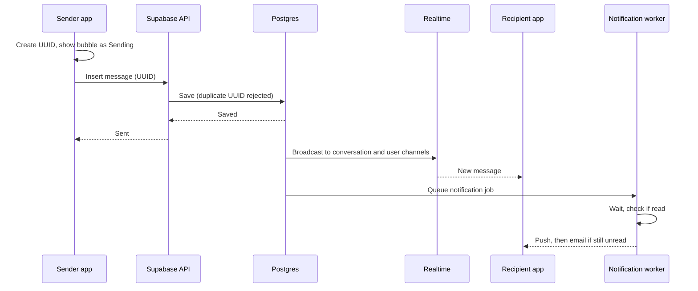

# ARCHITECTURE.md — Syndicate (working name)

How the platform is built so that many people can use it at the same time without slowing down or falling over. Read with DESIGN.md (how it looks) and UI_PROMPTS.md (how screens are generated).

> Plan limits and prices for Supabase, Vercel and the other services change. Every number marked "check" must be confirmed against the provider's current pricing page before you commit to a plan or quote a customer.

---

## 1. What "not crashing" actually means here

For this kind of app, outages almost never come from "too many users" in general. They come from a few specific, predictable spikes and mistakes:

| Risk | What happens | Section |
|---|---|---|
| **Announcement spike** | The class lead posts, push and email go to everyone, and most of the cohort opens the app within the same 2 minutes | 4, 8 |
| **Invite blast** | 81 (or 800) magic-link emails go out at once and people sign in together | 6 |
| **Database connections run out** | Serverless functions each open a database connection; under load they exceed the limit and every request fails | 5.2 |
| **Slow queries** | Missing indexes or heavy security rules make each request slower as data grows, until requests time out | 5.3, 5.4 |
| **Realtime limits** | Each open app holds a live connection; the plan's connection limit is hit and messages stop arriving | 7 |
| **Email limits** | The default email sender is heavily rate limited; magic links stop arriving and nobody can sign in | 6 |
| **Free tier behaviour** | Free projects pause when idle or have no backups; the app is "down" one morning | 10 |
| **One bad deploy** | A broken release goes straight to production | 11 |

The architecture below handles each of these directly.

---

## 2. Capacity tiers

Plan for three stages. Build for tier 1, but make choices that don't need a rewrite to reach tier 3.

| | Tier 1: Pilot | Tier 2: Growth | Tier 3: Scale |
|---|---|---|---|
| Customers | SMP 102 only | One school, all programmes, plus 2–3 other schools | Many schools and professional bodies |
| Registered users | ~100 | ~5,000 | ~50,000 |
| Peak simultaneous users (planning figure) | 81 (assume everyone at once) | ~1,000 (20%) | ~5,000–7,500 (10–15%) |
| Peak messages per second | ~5 | ~50 | ~300 |
| Peak sign-ins per minute | ~80 | ~500 | ~2,000 |
| Database size | < 100 MB | ~2 GB | ~20–50 GB |
| Target uptime | 99.5% | 99.9% | 99.9%+ |

**Design rule:** at every tier, the system must handle **3× the planned peak** without errors. Tier 1 is load tested for 250 simultaneous users, even though the cohort has 81.

For context: tier 1 is very small for this stack. A correctly configured setup handles the pilot easily. The work in this document is mostly about getting the configuration right from day one so that tier 2 and 3 are upgrades, not rebuilds.

---

## 3. System overview

**Key decisions**
1. **One region for everything that talks to the database.** Vercel functions run in the same region as the Supabase project. A function in the US calling a database in Europe adds 80–150ms to every query and multiplies under load. Pick the Supabase region first (a European region such as London or Frankfurt is usually closest to Lagos; measure latency from Lagos for 2–3 candidates before deciding), then set Vercel's function region to match.
2. **Most reads go through the Supabase API (HTTP), not raw database connections.** The API manages its own connection pool, so thousands of users don't mean thousands of connections.
3. **Anything slow or fan-out (emails, push, exports) goes through a queue,** never inside the user's request.
4. **Realtime uses per-user and per-channel broadcast,** not "listen to every change on the messages table".

---

## 4. Rendering and caching

| Content | How it's served | Why |
|---|---|---|
| App shell, CSS, fonts, icons, the tide SVG | Static, from the edge network, cached for a year with hashed filenames | Costs nothing to serve, loads fast on slow networks |
| Sign-in, privacy notice, terms | Static pages | No database at all |
| Directory for a cohort | Fetched once per session, cached on the device; server-side cached per cohort and invalidated when any profile in that cohort changes | Profiles change rarely; 81 people opening the directory should cause ~1 database read, not 81 |
| Profiles | Same cache as the directory, plus revalidated on open | |
| Messages, unread counts, notifications | Never cached; live from database and realtime | Must be correct |
| Desk and admin stats | Precomputed every 5 minutes into a stats table (see 5.5) | Avoids heavy counting queries on every page view |

**The announcement spike in practice:** when everyone opens the app at once, they load the shell from the edge (no server work), the directory from cache (one database read per cohort), and the announcement itself (one small indexed query each). That is why this pattern survives spikes that would crash an app that queries everything on every open.

**Client-side:** use TanStack Query (or SWR) with sensible stale times: directory 5 minutes, profile 1 minute, notifications 30 seconds when realtime is down. Requests are deduplicated, so three components asking for the same data make one request.

---

## 5. Database

### 5.1 Core tables
`organisations`, `programmes`, `cohorts`, `users`, `memberships` (user, cohort, role), `profiles`, `profile_field_visibility`, `invites`, `conversations`, `conversation_members`, `messages`, `channels`, `announcements`, `announcement_reads`, `board_posts`, `notifications`, `push_subscriptions`, `consents`, `audit_log`, `cohort_stats`, `feature_flags`, `privacy_requests`, `reports`.

Every table holding cohort data has a `cohort_id` (or reaches one through a single join). IDs are UUIDs. Timestamps are `timestamptz` in UTC; display converts to WAT.

### 5.2 Connections
- The browser talks to Supabase through `supabase-js` (HTTP). No connection limits to worry about there.
- Server code that needs direct SQL connects through the **Supavisor pooler in transaction mode** (port 6543), never the direct database port, because serverless functions open and close connections constantly.
- Background workers use the pooler too.
- Alert when connections exceed 70% of the plan's limit.

### 5.3 Indexes (create from day one)
- `memberships (user_id)`, `memberships (cohort_id, role)`
- `profiles (cohort_id, surname, first_name)`
- `messages (conversation_id, created_at desc)`
- `conversation_members (user_id, last_read_at)`
- `notifications (user_id, read_at, created_at desc)`
- `announcements (cohort_id, pinned, created_at desc)`
- `invites (cohort_id, status)`
- Search: a `tsvector` column on profiles (name, role, company, industry, can-help-with) with a GIN index, plus `pg_trgm` trigram indexes on names for typo-tolerant search ("Okafo" finds "Okafor").

Every new query is checked with `EXPLAIN ANALYZE` before it ships. No query on a user-facing path may do a sequential scan on a table over 10,000 rows.

### 5.4 Row Level Security that stays fast
Security rules run on every row of every query, so slow rules make the whole app slow.
- Wrap auth calls so they run once per query, not once per row: `(select auth.uid())`, not `auth.uid()`.
- Put membership checks in `security definer` helper functions (e.g. `is_member_of(cohort_id)`, `is_lead_of(cohort_id)`) that hit the indexed `memberships` table.
- Always add an explicit `where cohort_id = …` filter in queries as well, so Postgres can use indexes rather than relying on the policy to filter.
- Test policies with realistic data volumes (seed 50,000 fake users in staging).

### 5.5 Pagination and heavy reads
- Every list uses **cursor pagination** (`where created_at < :cursor order by created_at desc limit 30`), never `offset`. Offsets get slower as data grows.
- Directory pages load 50 at a time; messages 30 at a time; tables 50 rows.
- Desk and admin numbers (invited, joined, active this week) come from `cohort_stats`, refreshed by a scheduled job (`pg_cron`) every 5 minutes, not by counting live on every page view.

### 5.6 Growth path
1. Tier 1: smallest paid compute size.
2. Tier 2: upgrade compute size (a settings change, minutes of work), add point-in-time recovery.
3. Tier 3: read replica for directory and search reads; move search to a dedicated engine (Typesense or Meilisearch) if Postgres search gets slow; partition `messages` by month if it passes ~50 million rows.

---

## 6. Authentication and sign-in spikes

- **Use a custom email sender (Resend) for Supabase Auth from day one.** Supabase's built-in email sender is limited to a handful of emails per hour and is meant for testing only. Without this, an invite blast fails silently and nobody can sign in. (Check current limits.)
- Verify the sending domain with SPF, DKIM and DMARC so magic links land in inboxes, not spam. Corporate mail servers at banks and oil companies are strict.
- **Invites are sent through the queue in batches** (for example 20 per second), not in one loop inside a request. The desk shows progress ("Sent 54 of 81").
- Magic links expire in 15 minutes and work once. Sessions last 30 days with refresh tokens, so members rarely need to sign in again; that keeps sign-in traffic low after launch week.
- Rate limits: 5 magic-link requests per email per hour, 20 per IP per hour.
- Fallback: a 6-digit code in the same email, for corporate email systems that pre-open links and use them up before the person clicks.

---

## 7. Messaging and realtime

### 7.1 How a message flows
1. The client generates a UUID for the message (an **idempotency key**) and shows the bubble immediately as "Sending".
2. It inserts the message through the API. If the network drops and the client retries, the same UUID means the database rejects the duplicate instead of saving it twice.
3. A database trigger updates the conversation's `last_message_at` and enqueues a notification job.
4. The server broadcasts the new message on the conversation's realtime channel (`conversation:{id}`) and a small "you have a new message" event on each recipient's personal channel (`user:{id}`).
5. The notification worker checks, after a short delay (for example 60 seconds), whether the recipient has read it; if not, it sends push, then email after a longer delay, respecting quiet hours.

### 7.2 Realtime rules
- Each signed-in app opens **one** realtime connection and joins a small number of channels: its own `user:{id}` channel always, plus the open conversation or channel. It does not subscribe to every conversation.
- Use **Broadcast** for messages, typing indicators and presence-like signals. Avoid "Postgres Changes" subscriptions on busy tables at scale; they check security rules for every subscriber on every change and become the bottleneck.
- Typing indicators are broadcast only, never stored, and throttled to one event every 3 seconds.
- Presence (online dots) is shown only in Messages, and only for people in your open conversation list, to keep presence traffic small.
- Reconnect with exponential backoff (1s, 2s, 4s… up to 30s) plus random jitter, so that when realtime blips, thousands of phones don't reconnect in the same second.
- **If realtime is unavailable,** the app falls back to polling the user's notifications every 15 seconds. Messaging slows down but keeps working.

### 7.3 Realtime capacity
- Simultaneous realtime connections are a plan limit (check current Supabase limits for each plan; they can usually be raised on request).
- Tier 1: ~81 connections, far under any paid limit.
- Tier 2: ~1,000 connections, needs a plan or add-on that allows it.
- Tier 3: ~5,000–7,500. Either a raised Supabase limit, or move chat to a dedicated provider (Stream). The messaging code is wrapped behind one internal module (`lib/chat`) so this switch doesn't touch the screens.

### 7.4 Message rules
- Max 4,000 characters per message, 10 MB per attachment.
- Rate limit: 30 messages per minute per user, 10 new conversations per hour per user (stops spam and runaway scripts).

---

## 8. Background jobs and fan-out

Anything that sends to many people, takes longer than a second, or talks to an outside service runs as a job.

| Job | Trigger | Notes |
|---|---|---|
| Send invites | Lead clicks "Send invites" | Batched, retried, progress shown on desk |
| Announcement fan-out | Announcement posted | Creates notification rows in one SQL statement, then sends push and email in batches |
| Message notifications | New message | Delayed, cancelled if read |
| Profile nudges | Lead clicks "Send nudge" | Max one nudge per member per 3 days |
| Stats refresh | Every 5 minutes (`pg_cron`) | Fills `cohort_stats` |
| Data export | Privacy request | Builds a file, emails a 24-hour download link |
| Cleanup | Nightly | Expired invites, old typing data, orphaned uploads |

**Implementation:** Supabase Queues (`pgmq`) with Edge Functions as workers for tier 1 and 2. If job volume grows or you need better retries and dashboards, move to a job service such as Inngest or Trigger.dev.

**Rules for every job:** idempotent (safe to run twice), retried up to 5 times with backoff, failures go to a dead-letter list visible in the super admin System health page.

**Announcement spike, staggered:** push notifications for large cohorts go out over 2–3 minutes rather than all in one second, which spreads the "everyone opens the app" spike out. For 81 people it makes no difference; for 2,000 it matters.

---

## 9. Protecting the system

### 9.1 Rate limits (Upstash Redis, sliding window)
| Action | Limit |
|---|---|
| Magic-link requests | 5 per email per hour, 20 per IP per hour |
| Messages | 30 per user per minute |
| New conversations | 10 per user per hour |
| Search | 60 per user per minute |
| Profile updates | 20 per user per hour |
| Invites | 500 per cohort per day |
| Any API route | 300 per user per minute |
| Per tenant (whole school) | A ceiling so one customer can't slow down others |

Exceeded limits return HTTP 429 and the app shows a clear message ("You're sending messages very quickly. Wait a minute and try again.").

### 9.2 Uploads
- Images are resized and compressed on the phone before upload (max 1600px, WebP or JPEG at 80%), so a 6 MB photo becomes ~300 KB. This matters on Nigerian mobile data and for storage costs.
- Avatars served through image transformations at the exact display sizes (56, 96, 128, at 2× density).
- Allowed types checked on the server, not just in the browser.

### 9.3 Graceful degradation
| If this fails | The app does this |
|---|---|
| Realtime | Polls every 15 seconds; banner not shown unless it lasts over 2 minutes |
| Push | Falls back to email after the normal delay |
| Email | Retries for up to 6 hours; super admin alerted |
| Search index | Falls back to simple name search |
| Analytics or Sentry | Ignored; never blocks the user |
| The whole backend | The PWA still opens from cache, shows the last loaded directory and messages, and queues new messages to send when back |

### 9.4 Offline and slow networks
- Service worker caches the app shell, the directory and the last 50 messages of recent conversations.
- Sends made offline are stored on the device and sent in order when the connection returns (using the idempotency key, so no duplicates).
- Every request has a timeout (10 seconds) and shows the skeleton, not a frozen screen.

---

## 10. Environments, plans and costs

### 10.1 Environments
| Environment | Purpose | Data |
|---|---|---|
| Local | Development (Supabase CLI running locally) | Fake seed data |
| Preview | Every pull request gets its own Vercel preview | Points to staging |
| Staging | Separate Supabase project, mirrors production settings | 50,000 fake users for load tests; never real cohort data |
| Production | Live | Real data |

### 10.2 Plans to use from day one
- **Supabase: a paid plan for production, not Free.** Free projects pause after a period of inactivity and don't include the daily backups you need as a data processor. (Check current terms.)
- **Vercel: a paid plan.** The free Hobby plan is for non-commercial use, and this is a commercial product. (Check current terms.)
- Resend, Sentry, PostHog, Upstash: their free tiers are enough for tier 1.

### 10.3 Rough monthly cost (planning only, check current prices)
| Tier | Rough cost | Main drivers |
|---|---|---|
| Pilot | ~$50–80 | Supabase paid plan, Vercel paid plan |
| Growth | ~$200–500 | Larger database compute, point-in-time recovery, email volume, realtime |
| Scale | ~$1,000–3,000 | Database compute, read replica, chat provider or raised realtime limits, monitoring |

Price your licence so that one school comfortably covers its share of these costs, plus your time.

---

## 11. Releases without breaking things

- **GitHub Actions on every pull request:** type check, lint, unit tests, database migration test against a fresh database, and Playwright tests for the critical paths (sign in, claim profile, search, send message, post announcement).
- **Database changes only through migrations** (Supabase CLI), reviewed and applied to staging before production. Changes are backwards compatible: add a column, deploy code that uses it, remove the old one in a later release.
- **Feature flags** for new features: turn on for SMP 102 first, then everyone. Turning off a flag is the fastest rollback.
- **Instant rollback** of the web app through Vercel's previous deployments.
- Release on weekday mornings, never just before a class session or on Friday evening.

---

## 12. Monitoring and alerts

| What | Tool | Alert when |
|---|---|---|
| Is the site up | Uptime monitor (Better Stack or UptimeRobot) checking `/api/health` every minute from more than one region | 2 failed checks in a row |
| Errors | Sentry (front end and server) | New error type, or error rate over 1% for 5 minutes |
| Speed | Sentry performance or Vercel analytics | Server response p95 over 800ms for 10 minutes |
| Database | Supabase reports | CPU over 80%, connections over 70%, disk over 80% |
| Email | Resend dashboard and webhooks | Bounce rate over 5%, delivery failures |
| Jobs | Dead-letter list in super admin | Any job failed 5 times |
| Product health | PostHog | Weekly review, not alerts |

`/api/health` checks the database, auth and storage and returns which one is failing.

Alerts go to your phone (email plus a messaging app). A simple public status page lets the class lead check before messaging you.

**Targets (service level objectives)**
- 99.5% monthly uptime at tier 1, 99.9% from tier 2.
- API p95 under 300ms for reads, 500ms for writes, measured from Lagos.
- Message delivered to an online recipient in under 1 second, p95.
- Fewer than 0.5% failed requests.

---

## 13. Load testing

Use **k6** against staging before launch and before each tier upgrade. Each scenario runs at 3× the planned peak.

| Scenario | What it simulates | Pass criteria |
|---|---|---|
| Announcement spike | All members open the app within 60 seconds: load shell, directory, home, notifications | No errors, p95 under 500ms |
| Invite blast | Invites sent to a whole cohort, then 50% sign in within 5 minutes | All emails queued and sent, sign-in errors under 0.5% |
| Message storm | 10% of users each send 5 messages per minute for 10 minutes with realtime connected | Delivery p95 under 1 second, no duplicates, no dropped messages |
| Search burst | 20% of users run 10 searches each in 2 minutes | p95 under 400ms |
| Realtime reconnect | All realtime connections dropped and restored at once | All clients back within 60 seconds, no server overload |
| Soak | Normal traffic for 4 hours | No memory growth, no rising response times |

Record the results in this file under a "Load test log" heading with the date, tier and numbers.

---

## 14. Backups and recovery

- Daily automated backups (paid Supabase plan), retained per plan.
- Point-in-time recovery from tier 2.
- Weekly logical backup (`pg_dump`) to separate storage you control, encrypted.
- **Restore drill every quarter:** restore a backup into a fresh project and check it works. A backup you have never restored is not a backup.
- Targets: lose at most 24 hours of data at tier 1 (minutes with point-in-time recovery from tier 2), and be back online within 4 hours.

Write a short runbook for: site down, database overloaded, emails not arriving, data breach (includes notifying the controller promptly, as your processor agreement will require), and restoring from backup.

---

## 15. Security essentials that also protect stability
- Secrets only in Vercel and Supabase environment settings; never in code.
- The Supabase service-role key is used only in server code and workers, never in the browser.
- RLS turned on for every table, checked by an automated test that fails if any table has it off.
- Content Security Policy and secure headers on all pages.
- Dependency updates weekly (Dependabot or Renovate).
- Super admin actions require a second factor, and are always written to the audit log.

---

## 16. Build checklist by tier

**Before the SMP 102 pilot (tier 1)**
- [ ] Supabase and Vercel on paid plans, same region
- [ ] Custom email sender with verified domain
- [ ] Pooler connection strings for all server code
- [ ] Indexes in 5.3 and fast RLS patterns in 5.4
- [ ] Idempotent message sending, cursor pagination everywhere
- [ ] Queue for invites, announcements and notifications
- [ ] Rate limits in 9.1
- [ ] Sentry, PostHog, uptime monitor, health endpoint
- [ ] Staging with fake data; k6 tests passing at 250 simultaneous users
- [ ] Daily backups confirmed and one restore tested
- [ ] Runbook written

**Before tier 2**
- [ ] Load tests at 3,000 simultaneous users
- [ ] Point-in-time recovery on
- [ ] Realtime connection limit raised or plan upgraded
- [ ] Per-tenant rate limits and tenant-level stats in admin
- [ ] Status page

**Before tier 3**
- [ ] Read replica, dedicated search engine if needed
- [ ] Decision on dedicated chat provider
- [ ] Message table partitioning plan
- [ ] On-call support arrangement beyond yourself
